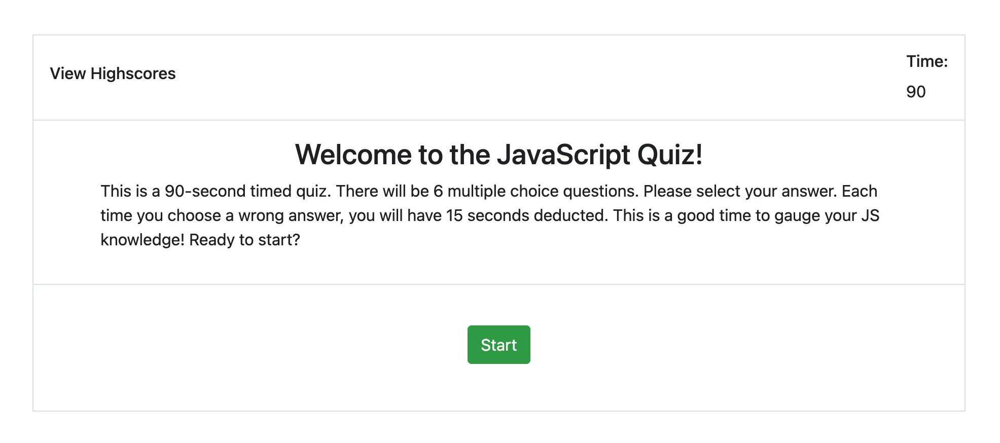

## Code Quiz
#### Description
Build a timed coding quiz with multiple-choice questions. The app will run in the browser and will feature dynamically updated HTML and CSS powered by JavaScript code. It will have a clean, polished, and responsive user interface.
#### Deployed Application

Here is the [link to the deployed website](https://herita7171.github.io/Herita7171/Code_Quiz/Develop/).
#### Review
* Application loads with no error
* Application user experience is intuitive and easy to navigate.
* Application user interface style is clean and polished.
* Application implements all the requirements from the user story.
* Application is deployed to GitHub Pages.